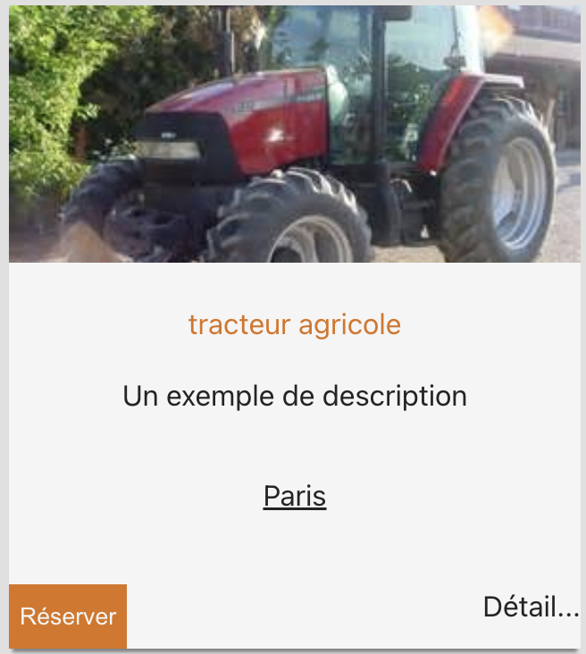
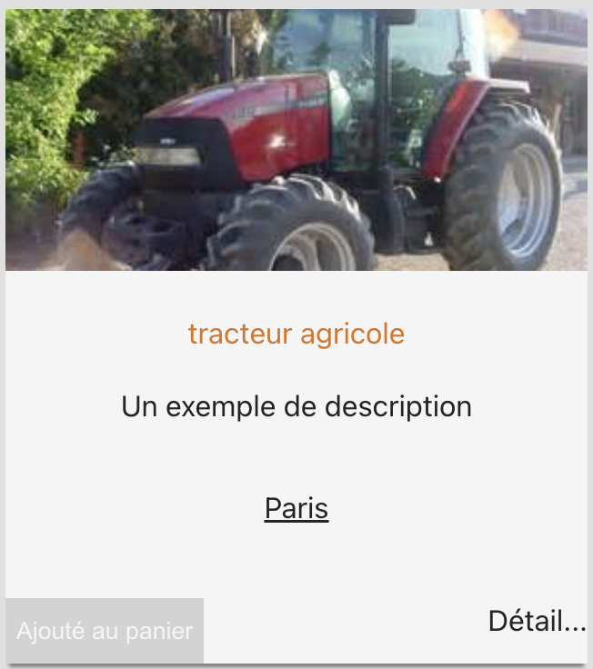

# About React context

**Problem you want to solve using Context**:

- You have several React components that are sharing the same state
- You want to notify several React components with the same user action (a button clicked, a value entered in an input...)
- You don't want to pass down too many `React.useState` props to several different React components

## Using the AppContext provided in this workshop

For Sotracteur, we provided an implementation of the React context with a specific model to interact with it.

This section is about explaining how to use this `AppContext` in your application.

For this documentation, we will consider that you've added the `AppContext` code inside `frontend/src/AppContext.jsx` file.

### Dispatchers, State and reducers

Let's consider the following `AppContext`:

```jsx
import React from "react";

export const initialState = {
  basket: [],
};

export function reducer(state, action) {
  switch (action.type) {
    case "NEW_BASKET_ITEM":
      const { item } = action;
      return {
        ...state,
        basket: [...state.basket, item],
      };
    default:
      return state;
  }
}

export const AppContext = React.createContext();

function useAppContext() {
  return React.useContext(AppContext);
}

export default useAppContext;
```

The `initialState` object is the `state` of your application that can be **shared** with several React components.

The `reducer` function is the function that is called when one of the React component of your application calls `dispatch` function with a give `action` object with a specific `action.type` string.

The `reducer` function will return a new value of the `state` objects which will **trigger** a **re-rendering** of **every** React components the uses the `state`.

### Initialize your AppContext

To use the app context, you fist need to initialize it.

From your root component in your frontend (`App.jsx` in the template), add the following code:

```jsx
import React from "react";
import { AppContext, reducer, initialState } from "./AppContext";
// ...

function App() {
  const [state, dispatch] = React.useReducer(reducer, initialState);

  return (
    <AppContext.Provider value={{ state, dispatch }}>
      {/* ... */}
    </AppContext.Provider>
  );
}

export default App;
```

1. [`React.useReducer`](https://react.dev/reference/react/useReducer) is initialized with the `initialState` of your application (in this case; an empty basket)
2. `AppContext.Provider` is the `React.Context` component which will offer the `{state, dispatch}` props to all its children

In the next steps, usage of `state` and `dispatch` is explain in details.

### useAppContext

To use the `state` and the `dispatch` function in your React component you want to use context for, just use the following hook:

```jsx
const { state, dispatch } = useAppContext();
```

To `dispatch` an `action`, use the following code in your React Component:

```jsx
function RentButton() {
  const { state, dispatch } = useAppContext();
  return (
    <button
      onClick={function () {
        dispatch({
          type: "NEW_BASKET_ITEM",
          item: { title: "red tractor" },
        });
      }}
    ></button>
  );
}
```

When user will click on the `RentButton`:

1. an `action` of `type` `NEW_BASKET_ITEM` will be `dispatched`
2. and the `reducer` function will be called with the `action` parameter which will be the object `{ type: "NEW_BASKET_ITEM", item: { title: "red tractor" } }`

   ```jsx
   function reducer(state, action) {
     switch (action.type) {
       case "NEW_BASKET_ITEM":
         const { item } = action;
         return {
           ...state,
           basket: [...state.basket, item],
         };
       default:
         return state;
     }
   }
   ```

> Note: the `...` notation is called the [spread operator / syntax](https://developer.mozilla.org/en-US/docs/Web/JavaScript/Reference/Operators/Spread_syntax) and enables you to `spread` arrays and object inside another object. Here it's the same as adding `item` to the `state.basket` array of item

3. This call to `reducer` will then shift the `state` from ...

   ```js
   {
     basket: [];
   }
   ```

   to

   ```js
   {
     basket: [{ title: "red tractor" }];
   }
   ```

4. **every** React components with the line `const { state, dispatch } = useAppContext()` or `const { state } = useAppContext()` will be `re-rendered`

Let's consider our `TractorCard` React component from [React.useState hook documentation](./REACT-USE-STATE-HOOK.md).

### Example: Réserver feature

**Feature**: When a user clicks on the `Réserver` button:

- The `Réserver` button is disabled and text becomes `Ajouté au panier`
- a new `item` is added the the `basket`
- a `Basket` React component displays the new `item` added

Considering the following `AppContext`:

```jsx
import React from "react";

export const initialState = {
  basket: [],
};

export function reducer(state, action) {
  switch (action.type) {
    case "NEW_BASKET_ITEM":
      const { item } = action;
      return {
        ...state,
        basket: [...state.basket, item],
      };
    default:
      return state;
  }
}

export const AppContext = React.createContext();

function useAppContext() {
  return React.useContext(AppContext);
}

export default useAppContext;
```

Initialized in the following `App` component:

```jsx
import React from "react";
import { AppContext, reducer, initialState } from "./AppContext";
// ...

function App() {
  const [state, dispatch] = React.useReducer(reducer, initialState);

  return (
    <AppContext.Provider value={{ state, dispatch }}>
      {/* ... */}
    </AppContext.Provider>
  );
}

export default App;
```

#### `RentButton` React component

The `RentButton` button React component will look like:

```jsx
import React from "react";
import useAppContext from "./AppContext";

export function RentButton({ tractor }) {
  const { state, dispatch } = useAppContext();
  function onRentClick() {
    dispatch({
      type: "NEW_BASKET_ITEM",
      item: tractor,
    });
  }

  // isRented is `true` if state.basket contains the `item` passed in props
  //                    (by checking the tractor id)
  // isRented is `false` otherwise
  // Note:
  //    `find(<condition function>)` checks if a basket's state incudes this
  //                                 tractor by checking only the `id` field
  //                                 of tractor, so `id` needs to be unique.
  const isRented = state.basket.find((t) => tractor.id === t.id);

  const buttonText = isRented ? "Ajouté au panier" : "Réserver";

  return (
    <button
      disabled={isRented}
      onClick={() => {
        onRentClick();
      }}
    >
      {buttonText}
    </button>
  );
}
```

This React component can be use inside the `TractorCard` component like:

```jsx
import React from "react";
import { RentButton } from "./RentButton";

function TractorCard() {
  const tractor = {
    id: 1,
    commune: "Paris",
    category: "tracteur agricole",
    description: "Un exemple de description",
    imageUrl: "https://touslestracteurs.com/images/Case_IH/CX90.jpg",
  };
  return (
    <div className="catalog-item">
      
      <div className="content">
        <span className="category">{tractor.category}</span>
        <p>{tractor.description}</p>
        <p>{tractor.commune}</p>
      </div>
      <div className="actions">
        <RentButton tractor={tractor} />
        <a>Détail...</a>
      </div>
    </div>
  );
}
```





#### `Basket` React component

The `Basket` React component looks like:

```jsx
import useAppContext from "./AppContext";

function EmptyBasket() {
  return <h4>Votre panier est vide</h4>;
}

export function Basket() {
  const {
    state: { basket },
  } = useAppContext();

  return (
    <table>
      <thead>
        <tr>
          <th>Catégorie</th>
          <th>Commune</th>
        </tr>
      </thead>
      <tbody>
        {basket.length > 0 ? (
          basket.map((item, idx) => (
            <tr key={idx}>
              <td>{item.category}</td>
              <td>Lieu: {item.commune}</td>
            </tr>
          ))
        ) : (
          <tr>
            <td colSpan="2">
              <EmptyBasket />
            </td>
          </tr>
        )}
      </tbody>
    </table>
  );
}
```

The line `const { state: { basket } } = useAppContext();` reads the `state.basket` proprety from the Application `state`.
When this value changes, the `Basket` React component gets `re-rendered`.

If some `item` are present in the `state.basket` array, then some table rows with `item.title` and `item.price` will be re-rendered.
If no items are in the `state.basket` array (e.g. initial state of the app), the the `EmptyBasket` React component will be rendered and the text `Votre panier est vide` will be displayed.


#### Summary

When a user clicks on a `Ajouter au panier` button, exposed by the `RentButton` React component, an `action` with `{ type: "NEW_BASKET_ITEM", item: {category: "...", commune: ... }}` is `dispatched` using the `dispatch` function obtain by the `useAppContext()` hook.

Then, the `reducer` function from the `AppContext.jsx` file is called and will transform the initial state of `{ state: { basket: [] } }` to `{ state: { basket: [ { category: "...", commune: ... } ] } }`.

A new `state` is set which will:

- re-render the `RentButton` button of the clicked item; which will render the button as `disabled` and replace the text to `Ajouté au panier`
- re-render the `Basket`; which will render the table with one row corresponding to the `item` dispatched

> You can have a look at the full picture in the [reactive template (branch: step-3b_useContext)](https://github.com/EPITA-SIGL2025-SOCRA/reactive-template/tree/step-3b_useContext)

That's all there is to know, with this setup, you should be able to implement **any** reactivity what so ever to your application.
