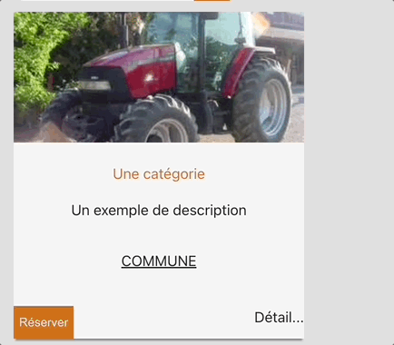

# `React.useState` hook

This page is about the basic `React.useState` hook that can be use to to handle simple reactivity at a React component level.

## Example: button `onClick`

Here is what we want to achieve:



When a user clicks on the `Réserver` button, we want it to be disabled and
replace the text by `Ajouté au panier`.

Here is how the `TractorCard` React component is written:

```jsx
import React from "react";

function TractorCard() {
  return (
    <div className="catalog-item">
      
      <div className="content">
        <span className="category">Une catégorie</span>
        <p>Un exemple de description</p>
        <p>COMMUNE</p>
      </div>
      <div className="actions">
        <button>Réserver</button>
        <a>Détail...</a>
      </div>
    </div>
  );
}
```

This React component is not interactive yet. When called with `<TractorCard />` , it renders the following:
.

Now, you can add an `onClick` `props` to the default `button` JSX element to trigger some function when the button is being clicked by a user.

For instance,

```jsx
function TractorCard() {
  return (
    <div className="catalog-item">
      
      <div className="content">
        <div className="content">
          <span className="category">Une catégorie</span>
          <p>Un exemple de description</p>
          <p>COMMUNE</p>
        </div>
      </div>
      <div className="actions">
        <button
          onClick={function () {
            console.log("I got clicked!");
          }}
        >
          Réserver
        </button>
        <a>Détail...</a>
      </div>
    </div>
  );
}
```

If we zoom on the code we've just added:

```jsx
onClick = {
  function() {
    console.log("I got clicked!");
  },
};
```

When a user will click on the button, a new message with `I got clicked!` will be displayed in the browser console.

React offers a hook called [React.useState](https://react.dev/reference/react/useState).
Hooks are function that you can only call at the root of a React component.

This `React.useState` hooks gives us back an array of 2 values:

- a `value`
- a `function` that returns a new `value`.

**And whenever the `value` of the `React.useState` hook changes, the component gets re-rendered**.

Here is how you can use it:

```jsx
import React from "react";
function TractorCard() {
  // Creates a new local state using the hook `React.useState`;
  //  initialized to false the first rendering
  //  when a user clicks button:
  const [isRented, setRent] = React.useState(false);

  return (
    <div className="catalog-item">
      
      <div className="content">
        <div className="content">
          <span className="category">Une catégorie</span>
          <p>Un exemple de description</p>
          <p>COMMUNE</p>
        </div>
      </div>
      <div className="actions">
        <button
          disabled={isRented}
          onClick={function () {
            setRent(true);
          }}
        >
          {isRented ? "Ajouté au panier" : "Réserver"}
        </button>
        <a>Détail...</a>
      </div>
    </div>
  );
}

export default TractorCard;
```

This line...

```jsx
const [isRented, setRent] = React.useState(false);
```

...calls the function `React.useState` with the initial value of `false`.
It means that `isRented` is equal to `false` when the component will render for the first time.

Then:

1. On the first rendering of this React component:

   1. `isRented` is set to `false`
   2. the button with then **not** be disabled by the button `props` `disabled` since `disabled={isRented}` will be like saying `disabled={false}`
   3. and the text inside the button returned by the [ternary](https://developer.mozilla.org/en-US/docs/Web/JavaScript/Reference/Operators/Conditional_operator) `isRented ? "Ajouté au panier" : "Réserver"` will return `Réserver` since `isRented` is `false`.

2. When a user clicks on the `button`; the function...

   ```jsx
   function() {
       setRent(true);
   }
   ```

   ...is called and will set the `isRented` value to `true`.

3. Because the `isRented` value changed from ~~`false`~~ to `true`, the `TractorCard` component will be re-rendered but this time the `isRented` value will be set to `true`.
4. the button with then become `disabled` with this props `disabled={isRented}` since it will be like `disabled={true}`.
5. and the [ternary](https://developer.mozilla.org/en-US/docs/Web/JavaScript/Reference/Operators/Conditional_operator) `isRented ? "Ajouté au panier" : "Réserver"` will return `Ajouté au panier` since `isRented` is `true`

## Read the doc

Feel free to read more on this hook [on the official documentation of React](https://react.dev/reference/react/useState)
